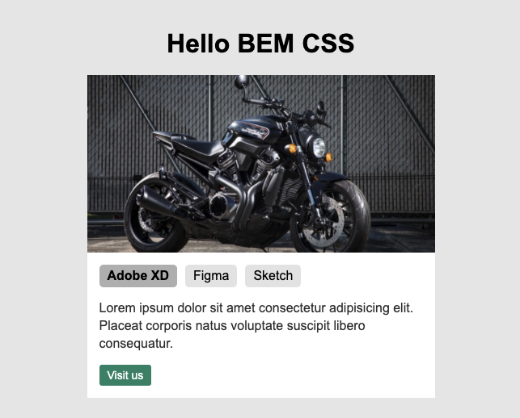

# CSS Modular com BEM
BEM (Block Element Modifier) Bloco Elemento Modificador.

Este repositório tem um simple exemplo de como utilizar o **[BEM](https://en.bem.info/)** para estruturar seu **HTML** e **CSS** nomeando suas classes baseando-se nas propriedades do elemento.

